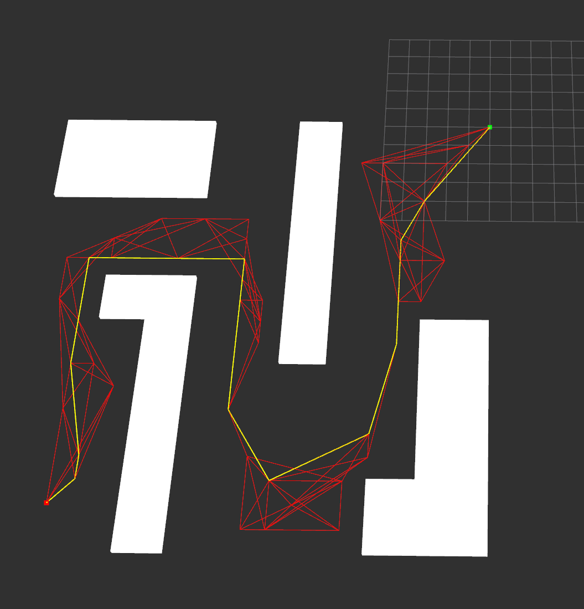

# Probabilistic Roadmap Algorithm

This was adapted from visualization of the RRT algorithm [here](https://github.com/Malintha/rrt-ros)

## Prerequisites
You need to have installed [ROS - Robot Operating System](http://www.ros.org/) in your system.

## Running and visualization

`catkin_make`

Source the setup file of the rrt-ros to make the rrt-planning package visible to ros.

`source devel/setup.bash` 

Run roscore in another terminal.

`roscore`

Then run rrt node as follows.

`rosrun rrt-planning prm`

You will be now promped to run rviz for visualization. Then run Rviz in another terminal.

`rviz`

You may also need to use:

`rosrun tf static_transform_publisher 0 0 0 0 0 0 1 map base_link 10`

Add a marker listener to rviz!

There is also a python interface that implements exactly the code in `prmImpl.h`.

The parameters you may adjust are `numNodes` which controls the number of nodes to sample to create the PRM, the number of neighbors to keep in the PRM (k closest nodes).

Below are some examples of runs varying these parameters. The red represents the contstucted roadmap while the yellow is the shortest path from start to goal on this roadmap.

